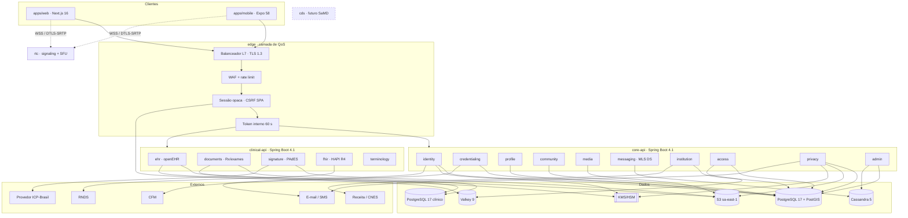
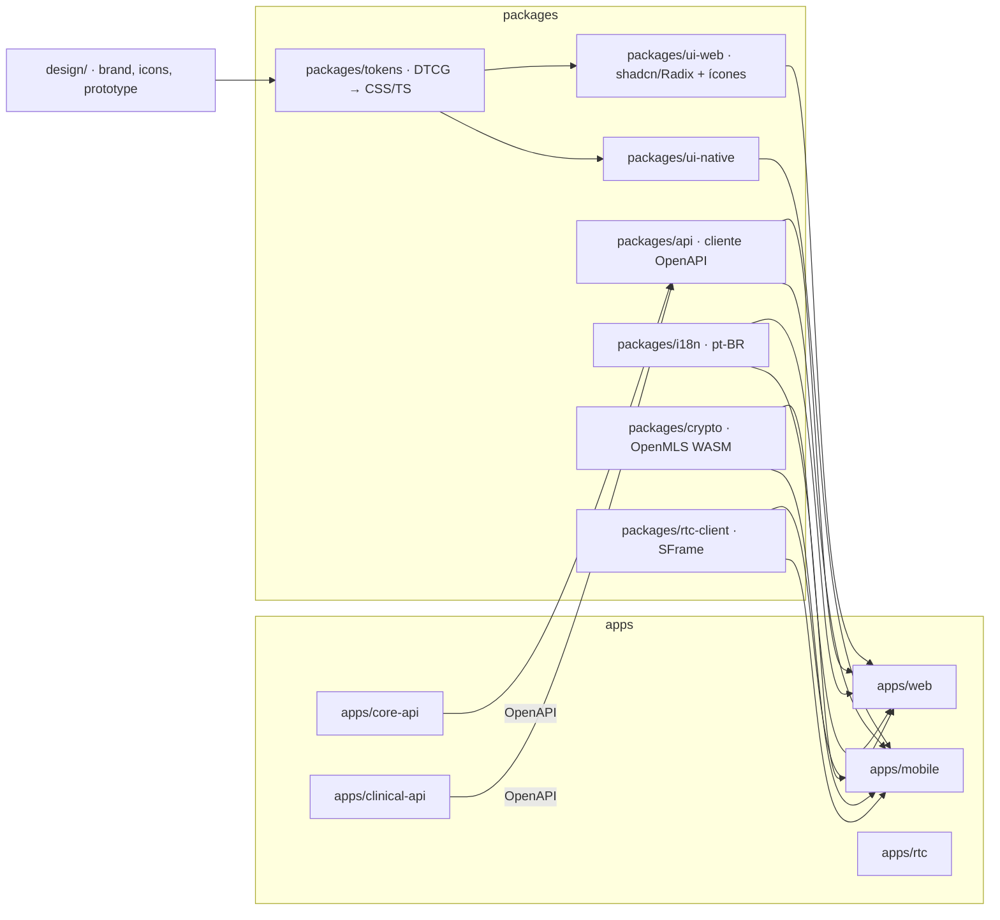

# Diagrama de componentes

## Visão de implantação

```mermaid
flowchart TB
    subgraph Clientes
      WEB[apps/web · Next.js 16]
      MOB[apps/mobile · Expo 58]
    end
    subgraph Edge["edge · camada de QoS"]
      LB[Balanceador L7 · TLS 1.3]
      WAF[WAF + rate limit]
      SESS[Sessão opaca · CSRF SPA]
      TOK[Token interno 60 s]
    end
    subgraph Core["core-api · Spring Boot 4.1"]
      ID[identity]
      CRED[credentialing]
      PROF[profile]
      COMM[community]
      MEDIA[media]
      MSG[messaging · MLS DS]
      INST[institution]
      ACC[access]
      PRIV[privacy]
      ADM[admin]
    end
    subgraph Clinical["clinical-api · Spring Boot 4.1"]
      EHR[ehr · openEHR]
      DOCS[documents · Rx/exames]
      SIG[signature · PAdES]
      FHIR[fhir · HAPI R4]
      TERM[terminology]
    end
    RTC[rtc · signaling + SFU]
    CDS[cds · futuro SaMD]:::future
    subgraph Dados
      PG[(PostgreSQL 17 + PostGIS)]
      PGC[(PostgreSQL 17 clínico)]
      VK[(Valkey 9)]
      CS[(Cassandra 5)]
      S3[(S3 sa-east-1)]
      KMS[[KMS/HSM]]
    end
    subgraph Externos
      CFM[CFM]
      CNPJ[Receita / CNES]
      ICP[Provedor ICP-Brasil]
      RNDS[RNDS]
      MAIL[E-mail / SMS]
    end
    WEB & MOB --> LB --> WAF --> SESS --> TOK
    TOK --> Core & Clinical
    WEB & MOB -. WSS / DTLS-SRTP .-> RTC
    ID & CRED & PROF & COMM & INST & ACC & PRIV & ADM --> PG
    SESS & ACC --> VK
    MSG & ADM --> CS
    MEDIA & PRIV --> S3
    EHR & DOCS --> PGC
    DOCS & SIG --> S3
    ID & PRIV & EHR --> KMS
    CRED --> CFM
    INST --> CNPJ
    SIG --> ICP
    FHIR --> RNDS
    ID & PRIV --> MAIL
    classDef future stroke-dasharray: 5 5
```

## Monorepo

```mermaid
flowchart LR
    subgraph apps
      web[apps/web]
      mobile[apps/mobile]
      core[apps/core-api]
      clinical[apps/clinical-api]
      rtc[apps/rtc]
    end
    subgraph packages
      tokens[packages/tokens · DTCG → CSS/TS]
      uiw[packages/ui-web · shadcn/Radix + ícones]
      uin[packages/ui-native]
      api[packages/api · cliente OpenAPI]
      i18n[packages/i18n · pt-BR]
      crypto[packages/crypto · OpenMLS WASM]
      rtcc[packages/rtc-client · SFrame]
    end
    design[design/ · brand, icons, prototype]
    design --> tokens --> uiw & uin
    uiw & api & i18n & crypto & rtcc --> web
    uin & api & i18n & crypto & rtcc --> mobile
    core & clinical -- OpenAPI --> api
```
